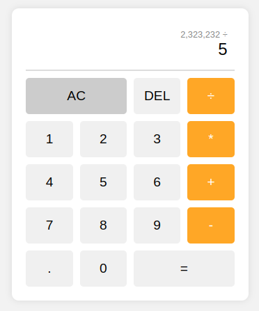

# JavaScript Calculator

A simple calculator application built with JavaScript, HTML, and CSS.

## Overview

This calculator allows users to perform basic arithmetic operations such as addition, subtraction, multiplication, and division. It features a responsive user interface with number buttons, operation buttons, and a display for showing the current and previous operands.

## Features

- Add, subtract, multiply, and divide numbers
- Clear the current input
- Delete the last character
- Responsive design for use on various devices

## Usage

To use the calculator, simply click on the number buttons to input numbers and the operation buttons to choose an operation. Click on the equals button to compute the result. You can also clear the current input or delete the last character using the provided buttons.

## Preview

## Installation

No installation is required. Simply clone the repository or download the files and open the `index.html` file in your web browser.

## Contributing

Contributions are welcome! Feel free to fork the repository, make changes, and submit a pull request.

## License

This project is licensed under the [MIT License](../LICENSE).
